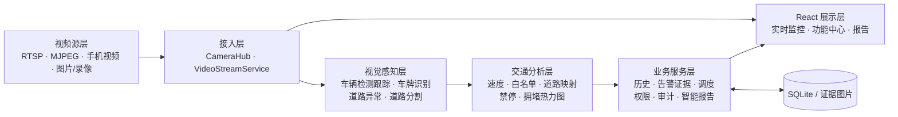
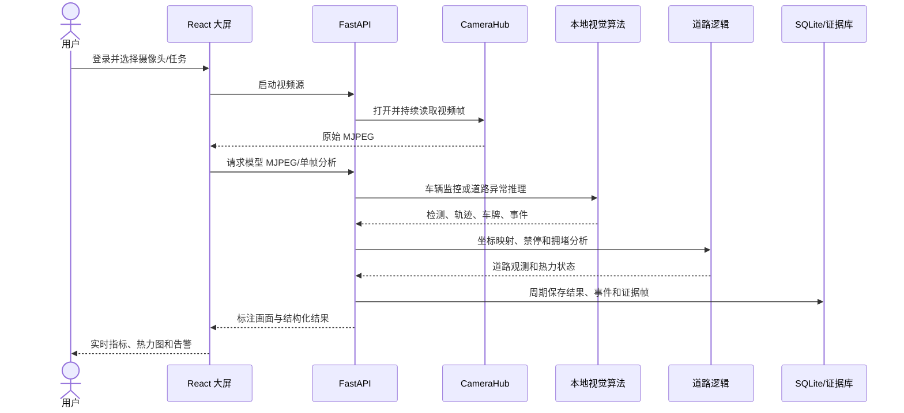

# 项目功能模块盘点

## 1. 项目定位

STrans 是面向智慧交通沙盘的视觉感知与管理平台。系统接入网络摄像头、手机视频、本地图片或录像，在计算机端完成车辆与道路场景分析，通过 Web 大屏呈现实时画面、识别结果、道路状态和告警，并把历史、证据、处置、权限和审计统一写入 SQLite，形成“采集—识别—分析—处置—归档”的闭环。

建议结题报告使用以下一句话概括：

> 本项目构建了一套面向交通沙盘的多源视频视觉感知平台，以车辆检测跟踪、车牌识别和道路异常识别为核心，通过道路标定、拥堵热力图、白名单决策和告警处置实现可演示、可追溯的智慧交通业务闭环。

## 2. 系统边界

### 2.1 系统输入

- RTSP/MJPEG 网络视频流；
- 手机网络摄像头视频；
- 本地图片和本地录像；
- 摄像头配置、模型阈值和任务模式；
- 用户、白名单和告警处置信息。

### 2.2 系统输出

- 原始及模型标注 MJPEG 画面；
- 车辆框、跟踪 ID、车牌、速度和白名单决策；
- 道路异物、道路行人和道路破损候选；
- 当前车辆数、密度、拥堵等级、道路/路口热力状态；
- 禁停、拥堵、白名单和道路异常事件；
- 历史记录、CSV/JSON 导出、带哈希校验的告警证据包；
- 系统资源状态、自适应模型策略和智能分析报告。

### 2.3 外部参与者

| 参与者 | 主要职责 |
|---|---|
| 普通用户 | 登录、查看实时监控、切换识别模式、查询历史和告警、查看报告与白名单 |
| 管理员 | 管理摄像头、用户、白名单和模型参数，启停自适应调度，生成报告，查看审计 |
| 视频源 | 提供实时流、图片或录像帧 |
| 本地/远程算法服务 | 返回结构化检测结果；默认使用本地模型，可选接入远程算法服务 |
| 智能报告服务 | 根据检测、拥堵、事件、天气和历史生成归档报告 |

标准 UML 用例图源见 [use-case.puml](diagrams/use-case.puml)。

## 3. 总体功能架构

组件关系的 UML 图源见 [component-architecture.puml](diagrams/component-architecture.puml)。

## 4. 已完成功能模块

### 4.1 视频接入与摄像头管理

- 摄像头来源的新增、修改、删除、连通性测试、单路或批量启停；
- 多路状态查询、原始 MJPEG 转发和模型标注 MJPEG 输出；
- 本地静态图片与实时流采用不同的处理策略；
- 对日志中的视频源地址做脱敏，降低凭据泄漏风险；
- 支持 MediaMTX 作为安全转发层，并保留沙盘 RTSP 滚动录像及批量导出脚本。

核心实现：`CameraHub`、`VideoStreamService`、`/api/cameras/*`、`/api/video/*`。

### 4.2 车辆感知

- YOLO 检测交通目标；
- ByteTrack 维护多帧目标身份；
- 道路 ROI、尺寸、外观纹理和时序规则过滤误检；
- 远近视角自动选择，远景时裁剪重点区域并提高推理分辨率；
- 轨迹框平滑、短时预测补偿、重复车辆框抑制；
- 输出车辆数量、置信度、跟踪 ID 和标注画面。

核心实现：`LocalModelService.infer_frame`。

### 4.3 车牌识别与白名单决策

- HyperLPR3 对车辆裁剪区域执行车牌识别；
- 在未匹配或漏检情况下以全帧 OCR 作为补充；
- 车牌文本纠错、按轨迹缓存、多帧稳定和 OCR 预算控制；
- 将车牌关联至车辆，查询 SQLite 白名单并输出 `PASS/BLOCK`；
- 白名单新增、删除、查询与决策接口；
- 识别结果变化触发事件并进入历史/告警链路。

核心实现：`detect_plates`、`_stable_track_plate`、`_stable_decision`、`WhitelistStore`。

### 4.4 速度、道路映射与交通状态

- 使用车辆框底边中心作为地面接触点；
- 通过透视变换把图像坐标映射到厘米级参考平面；
- 使用时间差和世界坐标位移估算速度，并以中值窗口抑制抖动；
- 通过摄像头标定点和 RANSAC 单应矩阵映射至统一道路模型；
- 识别车辆所属车道/路口，维护活跃车辆状态；
- 综合活跃车辆数与平均速度计算车道、路口拥堵热力；
- 对交通车道内持续停留目标生成禁停告警。

核心实现：`LocalModelService._track_speed_cm_s`、`RoadLogicService.enrich`、`heatmap_snapshot`。

### 4.5 道路异常识别

- 车辆监控与道路异常是两个独立任务模式；
- 道路 ROI 内以背景差分发现新增局部变化；
- 使用 YOLO/ByteTrack 的车辆与行人结果解释合法道路使用者，避免把其当作异物；
- 使用光流判断全局相机运动，画面整体移动时暂停异常判定；
- 对亮度、颜色、纹理、轮廓和多帧一致性进行规则融合；
- 静态图片使用专门的静态场景候选分支；
- 可选调用道路破损模型补充坑洞/路损候选；
- 输出道路异物、道路行人、道路破损三类结果。

核心实现：`RoadAnomalyService`、`/api/road-anomaly/*`。

### 4.6 道路分割与热力图

- 本地 SegFormer-B0 Cityscapes 模型输出道路语义掩膜；
- 对掩膜结果做缓存，并向认证客户端提供数据 URL 与道路示意底图；
- 手机/移动视角的检测热点被裁剪在道路区域内；
- 已标定固定视角把车辆轨迹投影至道路/路口模型；
- 前端支持关闭、画面叠加和道路示意图三种热力图显示方式。

核心实现：`RoadMaskService`、`RoadLogicService`、`frontend/src/heatmap.js`。

### 4.7 数据闭环与管理功能

| 模块 | 已实现内容 |
|---|---|
| 身份认证 | 图片验证码、注册、登录、会话、退出、修改密码、管理员/普通用户权限 |
| 用户管理 | 用户角色、启停、密码重置、删除与审计 |
| 历史记录 | SQLite 持久化、筛选、删除、清理、CSV/JSON 导出 |
| 告警处置 | 事件列表、状态流转、处理人和备注 |
| 证据链 | 原始帧、标注帧、分析 JSON、事件 JSON、SHA-256 清单打包 |
| 模型配置 | 模型名、置信度、推理尺寸、检测间隔和任务模式 |
| 自适应调度 | 根据任务、静态/实时来源、CPU、内存、GPU、显存和推理耗时选档 |
| 系统监控 | CPU、内存、GPU、显存和推理耗时 |
| 智能报告 | 基于当前检测、车道拥堵、事件、天气和历史生成并归档报告 |
| 语音控制 | 切换摄像头/任务、打开功能页、控制热力图和查询部分指标 |

### 4.8 道路建模辅助工具

- 管理员从功能中心打开项目内置的同源道路建模页面；
- 支持道路节点、节点组、平行车道、建筑物和摄像头的可视化编辑；
- 支持摄像头画面标定点与道路实体绑定；
- 输出包含可编辑模型与派生逻辑的 `road_logic_modeler.v1` JSON；
- 工具作为离线配置生产模块，不参与每帧识别推理。

核心实现：`frontend/public/road_logic_modeler/`、`frontend/src/roadModeler.js`；详见 [M13-道路建模辅助工具.md](M13-道路建模辅助工具.md)。

## 5. 完成度与答辩口径

| 能力 | 当前状态 | 结题报告建议表述 |
|---|---|---|
| 多源视频接入 | 已完成 | 支持网络流、手机视频、本地图片和录像 |
| 车辆检测与跟踪 | 已完成 | YOLO + ByteTrack，并有沙盘场景误检过滤与时序稳定 |
| 车牌识别 | 已完成 | HyperLPR3、车辆裁剪与全帧补充、多帧稳定 |
| 白名单判定 | 已完成软件闭环 | 输出放行/拦截决策；不宣称已驱动物理闸机 |
| 当前车辆数/密度 | 已完成 | 多帧中值稳定后输出当前视角统计 |
| 跨线进出流量 | 数据结构保留，未形成完整算法闭环 | 不作为主要成果；`count_in/count_out` 仅作为接口兼容字段 |
| 速度估计 | 已完成参考视角，其他视角为估计值 | 强调单应标定与中值平滑，不宣称通用测速精度 |
| 拥堵热力图 | 已完成 | 基于活跃轨迹数量和速度的道路/路口实时状态 |
| 道路异物识别 | 已完成候选检测闭环 | 表述为“多线索候选检测 + 人工复核”，不表述为零误报 |
| 道路行人识别 | 已完成 | 仅在道路异常模式输出道路区域内行人告警 |
| 道路破损识别 | 已完成可选补充模型接口 | 依赖模型文件和样本质量，作为补充能力 |
| 交通事故/碰撞识别 | 未实现独立模型 | 不作为已完成识别任务 |
| 红绿灯状态识别 | 未在当前主链路实现 | 作为后续扩展，不列入完成成果 |
| 道路语义分割 | 已完成 | 用于移动视角热力图约束，不夸大为完整场景分割平台 |
| 道路可视化建模 | 已完成主页面集成 | 用于生产二维道路拓扑与摄像头标定 JSON；当前模型发布需人工审核 |
| 三维数字孪生 | 未实现完整 3D | 当前成果是二维道路模型、单应映射和实时状态投影 |

## 6. 端到端业务流程

UML 时序图源见 [realtime-analysis-sequence.puml](diagrams/realtime-analysis-sequence.puml)。

## 7. 可用于答辩的创新点

1. **任务隔离**：车辆业务统计与道路异常识别分为独立模式，减少互相污染。
2. **沙盘适配**：在通用 YOLO/ByteTrack 之上增加道路 ROI、远近视角、外观可信度、重复抑制和短时轨迹补偿。
3. **多层车牌策略**：车辆裁剪 OCR、全帧 OCR、轨迹记忆和白名单决策联合工作。
4. **几何与视觉融合**：把单应映射、道路模型和视觉轨迹结合，实现车道归属、禁停和热力图。
5. **可解释异常识别**：背景差分、光流、合法目标解释、颜色/纹理/形状和时序确认构成可说明的规则链。
6. **工程闭环**：识别结果不仅展示，还进入历史、告警处置、证据包、审计和智能报告。
