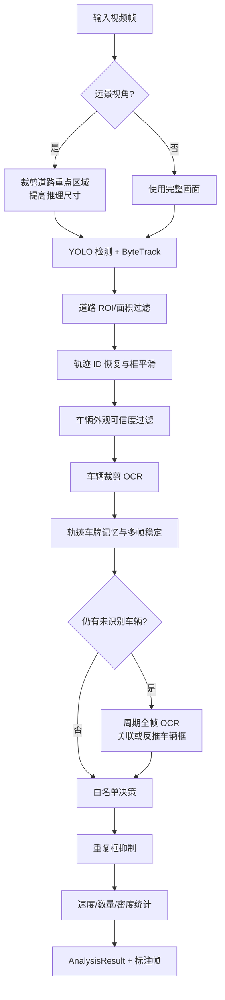
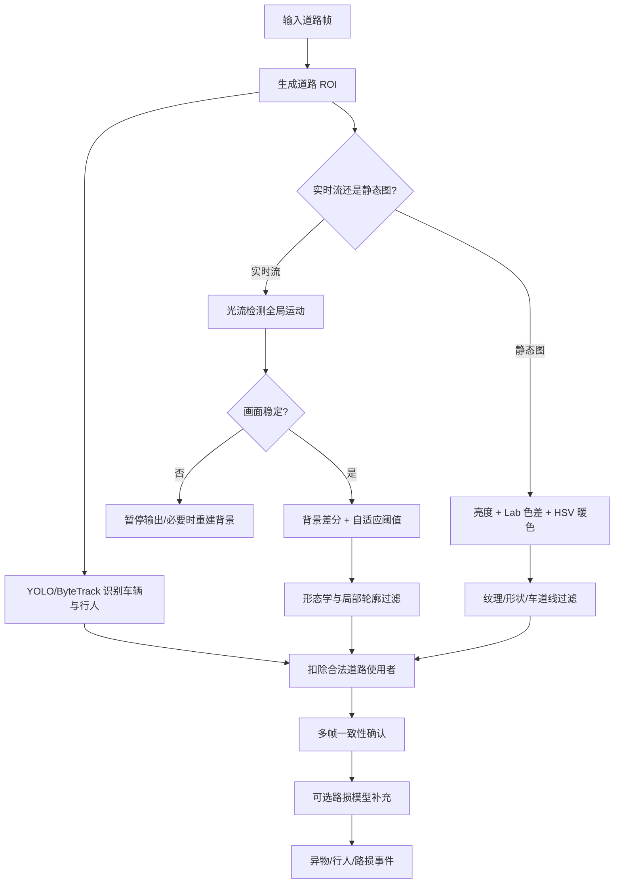
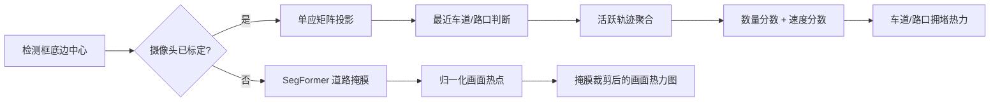
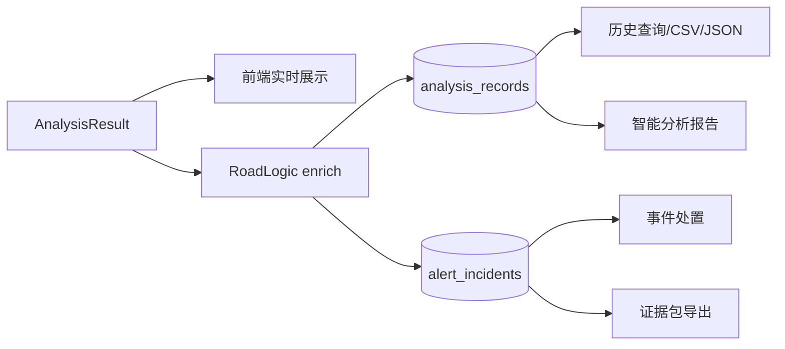

# 核心识别算法与流程设计

## 1. 设计原则

本项目的算法设计不是简单串联多个模型，而是围绕沙盘场景构建“模型感知 + 几何约束 + 时序记忆 + 业务规则”的复合流水线。各算法统一输出 `AnalysisResult`，其中包含检测框、交通统计、事件、耗时、模型标识和扩展元数据，便于前端展示、持久化和外部算法服务替换。

## 2. 任务一：车辆检测、跟踪与车牌识别

### 2.1 输入与输出

输入为单帧 BGR 图像、摄像头 ID、模型与阈值配置；输出为车辆/行人框、跟踪 ID、车牌、白名单状态、速度、统计值、事件和可选标注图。

### 2.2 算法步骤

1. **视角判断**：对自定义摄像头自动判断远景/近景。远景模式裁剪重点路段并把推理尺寸至少提高到 960。
2. **目标检测与跟踪**：YOLO 调用 ByteTrack 的 `track` 接口，并开启持久轨迹和类别无关 NMS。
3. **道路与几何过滤**：检测框必须落入摄像头道路 ROI，面积过小的目标被过滤。
4. **轨迹稳定**：缺少 ByteTrack ID 时按框位置恢复短时视觉 ID；对同一轨迹使用平滑框，暂时漏检时进行有限帧预测。
5. **外观可信度判断**：利用边缘密度、对比度和熵排除树木、灯杆、反光边缘等弱误检。
6. **车辆裁剪 OCR**：对车辆区域调用 HyperLPR3。实时流每轮限制 OCR 数量并轮转优先级，兼顾排队车辆与实时性。
7. **车牌时序稳定**：同一轨迹的 OCR 文本进入记忆，经过文本修正、多帧一致性和过期清理后再形成稳定车牌。
8. **全帧 OCR 补充**：存在未识别车辆时周期执行全帧 OCR；若车牌能归属已有车辆则补齐字段，否则从车牌位置反推车辆候选框。
9. **白名单决策**：稳定车牌查询白名单，输出 `allow/deny`、原因和业务事件；短时缓存防止车牌闪烁导致决策跳变。
10. **重复抑制与统计**：合并 YOLO 重叠框和车牌反推框；车辆数采用最近 5 次中值稳定。

UML 活动图源见 [vehicle-recognition-activity.puml](diagrams/vehicle-recognition-activity.puml)。

### 2.3 关键设计理由

- **低检测阈值后置过滤**：沙盘车辆小且常被树木遮挡，先保召回，再由道路、外观和时序规则排除误检。
- **OCR 预算**：车牌识别比普通框处理更重，实时流只处理部分车辆并轮转，避免第一辆车长期占用 OCR。
- **检测与车牌互补**：车牌既可补充车辆属性，也可在检测框偏移或漏检时反推车辆位置。
- **短时预测有限使用**：仅对已经证明可信的轨迹做短时补偿，并随时间衰减置信度，避免形成幽灵车辆。

### 2.4 速度估计算法

以检测框底边中心点作为车辆与路面的接触点。参考摄像头用四点标定得到图像平面到厘米平面的透视变换矩阵 (H)：

\[
\begin{bmatrix}X'\\Y'\\W'\end{bmatrix}
=H
\begin{bmatrix}x\\y\\1\end{bmatrix},\qquad
(X,Y)=\left(\frac{X'}{W'},\frac{Y'}{W'}\right)
\]

同一轨迹相邻有效观测的原始速度为：

\[
v_t=\frac{\sqrt{(X_t-X_{t-1})^2+(Y_t-Y_{t-1})^2}}{t_t-t_{t-1}}
\]

实现中设置像素死区和 1.5 cm 世界位移死区，过滤检测框轻微抖动；大于 200 cm/s 的异常值被拒绝；最近 5 个样本取中值，并通过连续静止命中把速度稳定为 0。非参考摄像头只能称为估计值。

## 3. 任务二：道路异常识别

### 3.1 识别对象

- 道路异物候选；
- 道路区域行人；
- 道路破损候选。

车辆监控模式负责车辆、车牌、速度和白名单；道路异常模式只输出异常目标，避免异常框进入车辆统计和热力图。

### 3.2 实时视频异常流程

1. 根据摄像头类型生成道路 ROI；
2. 图像转灰度并进行高斯平滑；
3. 通过稀疏光流估计全局相机运动，中位位移大于阈值时暂停检测；
4. 当前灰度图与稳定背景做绝对差分；
5. 使用 `max(28, 均值 + 2.2×标准差)` 作为自适应阈值；
6. 形态学开闭运算去除噪声并连接目标区域；
7. 若道路 ROI 变化比例超过 8.5%，视为相机移动或光照突变，不输出异物；
8. 轮廓按面积、长宽和局部性过滤；
9. 与当前及近期车辆/行人框比较，能被合法道路使用者解释的候选被剔除；
10. 候选需连续 3 次以 IoU≥0.30 匹配才确认为道路异物；
11. 无异常时以低权重更新背景，防止异常物体被快速吸收到背景。

### 3.3 静态图片异常流程

静态图片不存在时间差，系统使用专门分支：

- 亮度通道提取高亮实体；
- Lab 色度距离发现与主路面颜色明显不同的物体；
- HSV 暖色通道针对沙盘验收中常见的橙黄小物体；
- 通过轮廓填充率、圆度、凸包实心度、对比度、熵和白色占比过滤车道线、箭头和反光；
- 已确认车辆框和车牌代理区域作为“可解释目标”从掩膜中扣除；
- 普通静态候选连续 2 次、IoU≥0.35 后确认；
- 与时间差候选做 IoU/覆盖率合并，保留更高置信度结果。

UML 活动图源见 [road-anomaly-activity.puml](diagrams/road-anomaly-activity.puml)。

### 3.4 可解释性与限制

- 每一层过滤都有明确物理意义，适合在答辩中解释误报控制过程；
- 输出定义为“候选 + 复核”，因为光照、阴影、路面纹理和未标定视角仍会影响结果；
- 车载或手持移动视频不适合背景差分，系统会降级依赖静态外观或路损模型；
- 路损补充模型是否可用取决于本地权重部署。

## 4. 任务三：道路分割、坐标映射与拥堵热力图

### 4.1 移动视角道路分割

SegFormer-B0 Cityscapes 对输入帧做语义分割，从模型标签中找出道路类，双线性插值恢复到原图大小并输出二值掩膜。结果按摄像头做短时缓存。前端只在掩膜内部绘制检测热点，解决移动视角中热点漂到建筑、树木或天空的问题。

### 4.2 固定视角道路映射

每路已标定摄像头具有图像点与统一道路模型点。系统优先使用 RANSAC 求单应矩阵：

\[
s\mathbf{p}_{world}=H\mathbf{p}_{image}
\]

车辆框底边中心经 (H) 投影后，通过点到车道中心线距离和点在路口多边形内判断，得到车道、路口和道路有效性。

### 4.3 拥堵评分

系统只使用近期活跃、几何尺寸可信的车辆轨迹。每个车道/路口聚合唯一轨迹数和速度：

\[
score=0.85\times countScore+0.15\times speedScore
\]

其中速度项按 18 cm/s 归一化，车辆少时仍保持绿色或低拥堵，避免单辆车因低速把整条车道染红。热力图是当前交通状态，不是无限累积的历史轨迹图。

## 5. 任务四：自适应模型调度

自适应调度不是新的识别模型，而是保障识别任务稳定运行的策略层。输入包括任务类型、静态/实时来源、请求模型、置信度、推理尺寸、检测间隔、最近推理耗时和机器资源。

| 策略 | 触发条件 | 动作 |
|---|---|---|
| manual | 自适应关闭 | 完全使用人工配置 |
| quality | 静态图，或 GPU 余量充足且推理较快 | 提高推理尺寸，静态图降低置信度以保召回 |
| anomaly | 道路异常任务 | 保留 768–960 的小目标分辨率，限制检测频率 |
| protect | 显存≥88%、内存≥92% 或 CPU≥92% | 切备用模型、尺寸≤512、间隔≥350 ms |
| realtime | GPU≥88% 或推理耗时≥150 ms | 尺寸≤640、间隔≥180 ms |
| balanced | 资源正常 | 保持原配置 |

为了避免档位频繁抖动，非保护策略的切换具有 8 秒滞回；资源数据缓存 1.5 秒；只保留最近 120 条策略变更。

## 6. 统一结果与数据闭环

算法结果、事件和证据用同一 `event_id` 关联；证据包包含原始帧、标注帧、分析结果、事件信息和 SHA-256，用于证明截图未被替换。

## 7. 测试与验收指标建议

后续使用 F 盘数据集时，建议至少形成下表，避免仅展示“看起来正确”的截图：

| 任务 | 建议指标 | 最低材料 |
|---|---|---|
| 车辆检测 | Precision、Recall、F1、单帧耗时 | 不少于 50 张有标注图片或抽帧 |
| 车牌识别 | 车牌检测率、整牌字符准确率、平均耗时 | 按近景/远景/遮挡分组 |
| 道路异物 | 事件级 Precision、Recall、首次确认帧数 | 正常道路与多类异物对照 |
| 路损识别 | Precision、Recall 或典型正确/错误案例 | 明确模型权重和数据来源 |
| 跟踪稳定性 | ID Switch、轨迹保持率 | 选取连续短视频人工核验 |
| 系统性能 | FPS、P50/P95 推理耗时、CPU/GPU/显存 | 固定硬件和推理配置 |

所有例图应保留：数据文件名、任务模式、模型、阈值、推理尺寸、耗时、预测框和置信度。错误案例同样应进入报告，用于说明后续改进方向。
